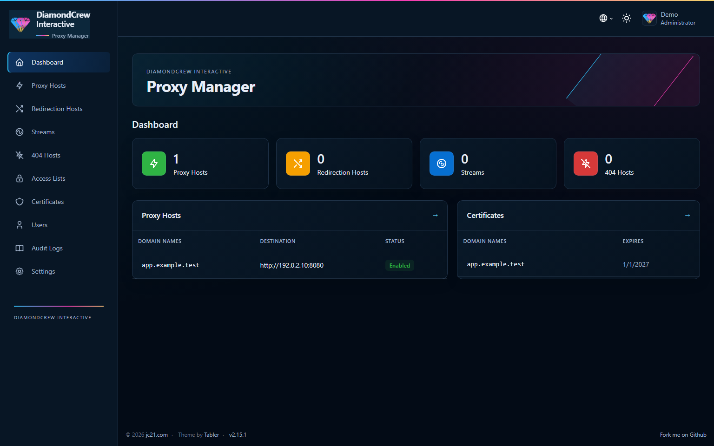

# DiamondCrew Interactive · Proxy Manager

Reskin skutečného **Nginx Proxy Manageru 2.15.1**, připravený pro DiamondCrew Interactive.
Tmavý navy dashboard, skutečné dodané logo, gradient `#2ec7ff → #f43cb2 → #f3d36b`,
boční navigace, přehledové karty, tabulky, formuláře a modaly. Zachovává původní
login, 2FA, oprávnění a NPM editory. Světlý režim i přepínač jazyků zůstávají dostupné.

**Source je publikovaný pouze ve větvi `smoke-test`; production release je vypnutý.**
Operátor DIA-01 potvrdil build, secret scan a image invariants. Integrační běh odhalil
chybu publikování portů na interní síti; oprava čeká na opakovaný Docker test.
Produkční NPM nebyl změněn. Lokální prohlížečové testy používají syntetická data a mock API.

Pro skutečný Docker build a integrační ověření je nyní připravený
[izolovaný smoke test pro DIA-01](docs/DOCKER-SMOKE.md): `scripts/smoke.py`.
Používá vlastní data, loopback porty a reálný backend/API; nic zde zatím nebylo
spuštěno proti Dockeru. Balíček pro release označí `VERIFIED` až po úspěšném
build/API/proxy/restart/rollback testu.



## Ověřený základ

| Položka | Hodnota |
| --- | --- |
| Snapshot backend package.json | `2.15.1` |
| Upstream tag | `v2.15.1` |
| Upstream commit | `76f09db610cfcaecf6d608a8947d6f75aa028870` |
| Původní image reference | `jc21/nginx-proxy-manager:latest` |
| Původní image ID = registry AMD64 config digest | `sha256:f44e23f5e4d7d71dae4548e273b498c567311c76502a128f3bc782f528a58087` |
| Připnutý index digest 2.15.1 | `sha256:52b2c59994f3d36acfcf70a1626f29734df0ed8c71bacc0269f78b6f939858bb` |
| Reskin verze | `2.15.1-dci.1.0.0` |

Verze `2.11.3` na grafickém návrhu není verze snapshotu. Referenční screenshot není
specifikace nového backendu: Discord login, Discord Access, notifikace a globální
vyhledávání nejsou přidány. Nezobrazujeme fiktivní dostupnost hostů nebo týdenní
statistiky. Dashboard zobrazuje existující report počtů, posledních pět vytvořených
Proxy Hosts a pět certifikátů seřazených podle expirace. Stav „Enabled“ znamená
povolenou konfiguraci, nikoli aktivní monitoring služby.

Frontend: **React 19.2.6, TypeScript 6.0.3, Vite 8.0.14, Tabler 1.4,
React Bootstrap 2.10, React Router 7, TanStack Query/Table, Formik, react-select,
react-intl**; konkrétní dependency resolution zůstává v upstream `yarn.lock`.
Snapshot obsahuje jen hotový `app/frontend`, nikoli zdrojový frontend.

Upstream pipeline je v [`scripts/ci/frontend-build`](https://github.com/NginxProxyManager/nginx-proxy-manager/blob/v2.15.1/scripts/ci/frontend-build):
Yarn install → lint → locale compile → Vitest → TypeScript/Vite build.
[`docker/Dockerfile`](https://github.com/NginxProxyManager/nginx-proxy-manager/blob/v2.15.1/docker/Dockerfile)
kopíruje `frontend/dist` do `/app/frontend`.

## Architektura a hranice změn

1. `scripts/prepare.mjs` načte `upstream.lock.json`, získá přesný upstream commit
   a odmítne jinou verzi nebo změněný checkout.
2. Zkopíruje pouze frontend do `.build/frontend`. Jedenáct malých prezentačních
   patchů kontroluje SHA-256 původního souboru a právě jeden výskyt každé náhrady.
3. Přidá `branding/src` a `branding/public`. Brand, CSS a read-only dashboard
   přehled jsou oddělené od upstream aplikace. Nové dotazy jsou uvnitř původních
   `HasPermission` hranic. Existující auth, API klient, validace, modaly, hooky
   a mutation logika se nemění.
4. Builder sestaví statické soubory pomocí připnutého Node 24.14.0 a Yarn 1.22.22.
   Finální image dědí přesný stock NPM digest a kopíruje pouze frontend + licenci.
   Původní entrypoint, backend, Nginx, Certbot a runtime prostředí jsou zděděné.

Přehledy používají existující `useProxyHosts` a `useCertificates`. Sidebar zplošťuje
původní menu se zachováním jeho oprávnění, rout a mobilního zavírání. Aktivní routa
má `aria-current`. Motiv používá standardní Tabler třídy a proměnné, nikoli hashe
minifikovaných bundle souborů nebo přepisování DOM mimo React.

## Soubory určené pro cílové repo

- `branding/`: logo, design tokens/CSS, Brand, Overview, striktní prezentační patche.
- `Dockerfile`, `.dockerignore`, `upstream.lock.json`: izolovaný build a pinning.
- `scripts/prepare.mjs`, `check-integrity.mjs`, `serve.mjs`: příprava a ověření frontendu.
- `scripts/ops.py`: ručně spouštěný backup, image-only deployment a rollback.
- `scripts/secret-scan.py`: allowlist zdrojů, Gitleaks a čistý ZIP pro předání.
- `tests/`, `playwright.config.mjs`, `package*.json`: browser a bezpečnostní testy.
- `deploy/`: ukázky image-only Compose override.
- `release/github-release.proposal.yml`: neaktivní workflow s výchozím vypnutím publikace.
- `docs/`: validace, bezpečnostní report, updaty a náhledy se syntetickými daty.
- `LICENSE.upstream`: původní MIT licence; upstream attribution v patičce zůstává.

Otevřená složka nebyla Git checkout. Původní `export-proxymanager/` je nedotčený,
ale **není součástí předávaného projektu**. `.gitignore` a `.dockerignore` používají
allowlist. Do cílového repa přenášejte obsah vygenerovaného source ZIPu, nikoli celý
workspace nebo export. Nepoužívejte `git add -f` pro snapshot či `.build`.

## Build frontendu a testy

Linux/WSL nebo CI, Node **24.14.0**, Yarn **1.22.22**, Python **3.11+**, Git:

```bash
npm ci
node scripts/prepare.mjs
cd .build/frontend
yarn install --frozen-lockfile --non-interactive
yarn locale-compile
yarn build
yarn vitest run --config ../../tests/upstream-vitest.config.mjs
cd ../..
node scripts/check-integrity.mjs .build/upstream/frontend
npx playwright install chromium
npm test
python3 -m unittest discover -s tests -p 'test_*.py'
python3 scripts/secret-scan.py --gitleaks /path/to/gitleaks --package
```

Testovací konfigurace Vitestu vynechává upstream dev-server hook, který spouští
`yarn` a Bash pro překlady; překlady jsou předem zkompilované. Produkční Vite
konfigurace se nemění. Pro lokální prohlížení `node scripts/serve.mjs`; tato služba
poskytuje pouze statické soubory na loopbacku a žádné produkční API.

Docker build (Linux AMD64 pro DIA-01):

```bash
docker buildx build --platform linux/amd64 --load \
  -t diamondcrew-interactive/proxy-manager:2.15.1-dci.1.0.0 .
docker run --rm --entrypoint node \
  diamondcrew-interactive/proxy-manager:2.15.1-dci.1.0.0 \
  -e "if(require('/app/package.json').version !== '2.15.1') process.exit(1)"
```

Image neobsahuje žádnou kopii snapshotu, produkční `.env`, DB, certifikátů,
credentials nebo privátních klíčů. Stock image přirozeně obsahuje své veřejné
upstream ukázky a CA trust store. Nejedná se o produkční tajemství.

## Persistentní data

| Bind mount na DIA-01 | Cesta v kontejneru | Obsah |
| --- | --- | --- |
| `/opt/nginx-proxy-manager/data` | `/data` | SQLite DB při standardním nastavení, proxy konfigurace, custom SSL, runtime klíče/logy a NPM data |
| `/opt/nginx-proxy-manager/letsencrypt` | `/etc/letsencrypt` | ACME účty, certifikáty, privátní klíče a obnova |

Proxy hosts, users, Access Lists a ostatní konfigurace jsou v DB. Žádný z těchto
adresářů se nekopíruje do custom image. Případná externí DB musí zachovat svou službu
a volume; automatický backup skript její přítomnost odmítne, dokud se nepřipraví
konzistentní nativní dump. Reskin nezavádí DB migraci; běžný upstream startup zůstává.

## DIA-01: záloha, deployment a rollback

**Následující příkazy jsou připravený postup, nebyly spuštěny.** Nejdřív dokončete
integrační checklist v [docs/VALIDATION.md](docs/VALIDATION.md). Zajistěte SSH/konzoli
mimo samotný proxy web: při recreate nastane krátký výpadek proxy provozu.

Build dělejte mimo produkční volumes. Hotový image lze přenést přes `docker save`
a `docker load`; publikování do registry není nutné.

Na DIA-01 ručně, z čistého adresáře tohoto projektu:

```bash
sudo python3 scripts/ops.py backup \
  --compose /opt/nginx-proxy-manager/docker-compose.yml \
  --service app \
  --backup /opt/npm-backups/before-dci-1
```

Backup ověří původní stock image ID a bind mounty. Uloží image TAR, originální
i plně vyhodnocený Compose, container inspect a SHA-256 manifest. Zastaví jen službu
`app`, pořídí konzistentní TAR `/data` a `/etc/letsencrypt` včetně vlastníků/ACL/xattrs
a službu znovu spustí i při chybě archivace. Plánujte tento krátký výpadek.
Privátní zálohu s právy 0700/0600 bezpečně zkopírujte i mimo host a ověřte obnovu.
Tato záloha obsahuje tajemství a nesmí do Gitu, release, CI artefaktů ani image.

Po otestování image:

```bash
sudo python3 scripts/ops.py deploy \
  --backup /opt/npm-backups/before-dci-1 \
  --image diamondcrew-interactive/proxy-manager:2.15.1-dci.1.0.0
```

Skript kontroluje checksumy zálohy, upstream label, změny Compose a aktuální mounty,
prostředí, porty a sítě. Použije lokální image ID, `--pull never`, `--no-deps`
a zachová původní projekt i absolutní persistentní cesty. Poté ručně ověřte stav
kontejneru, `http://127.0.0.1:81/api/`, login, proxy provoz a [checklist](docs/VALIDATION.md).
Následující provozní Compose příkazy musí používat oba soubory vypsané skriptem;
původní samostatný Compose stále obsahuje `latest` a nesmí se bez kontroly spouštět.

**Jednokrokový rollback na přesný původní stock NPM:**

```bash
sudo python3 scripts/ops.py rollback --backup /opt/npm-backups/before-dci-1
```

Rollback načte uložený stock image, ověří jeho ID a přepne stejnou službu se stejnými
volumes. **Neobnovuje starou DB ani certifikáty**, takže zachová změny konfigurace
provedené od reskinu. Nepoužívá `down`, mazání volumes ani nové datové adresáře.
Stock registry digest je také v `deploy/compose.stock.example.yml`, offline záloha
však zajišťuje návrat i bez registry.

Obnova datových TARů je samostatný disaster recovery postup: pouze při skutečné
ztrátě dat, se zastaveným NPM, po nové záloze aktuálního stavu, do původních mountů
a s obnovením vlastníků/ACL/xattrs. Není součástí běžného rollbacku motivu.

## Updaty a release

Nový upstream vyžaduje audit a nový pin; nikdy nestačí změnit `FROM` na `latest`.
Postup a rizika jsou v [docs/UPDATES.md](docs/UPDATES.md). Aktuální lokální výsledky
jsou v [docs/VALIDATION.md](docs/VALIDATION.md), secret scan v [docs/SECURITY-SCAN.md](docs/SECURITY-SCAN.md).

Workflow návrh zůstává mimo `.github/workflows`. Obsahuje ruční spuštění, testy,
scan, skutečný Docker smoke test a ověřené artefakty. Volitelný publish job je
výchozím nastavením vypnutý (`publish: false`); před aktivací nastavte povinné
reviewery prostředí `production-release`. Publikuje přesně otestovaný image,
bez nového buildu. Nemá deploy job. Žádný workflow zde nebyl spuštěn.
